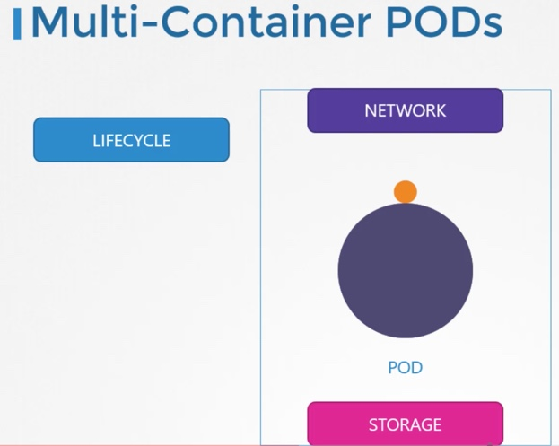
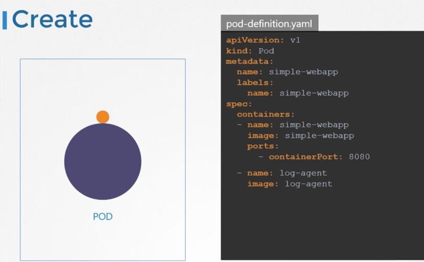

# Multi-Container Pods (10%)






- All the 3 patterns will use the same format of definition file.
- 
# Exercises


## Implementing the Adapter Pattern

The adapter pattern helps with providing a simplified, homogenized view of an application running within a container. For example, we could stand up another container that unifies the log output of the application container. As a result, other monitoring tools can rely on a standardized view of the log output without having to transform it into an expected format.

1. Create a new Pod in a YAML file named `adapter.yaml`. The Pod declares two containers. The container `app` uses the image `busybox` and runs the command `while true; do echo "$(date) | $(du -sh ~)" >> /var/logs/diskspace.txt; sleep 5; done;`. The adapter container `transformer` uses the image `busybox` and runs the command `sleep 20; while true; do while read LINE; do echo "$LINE" | cut -f2 -d"|" >> $(date +%Y-%m-%d-%H-%M-%S)-transformed.txt; done < /var/logs/diskspace.txt; sleep 20; done;` to strip the log output off the date for later consumption my a monitoring tool. Be aware that the logic does not handle corner cases (e.g. automatically deleting old entries) and would look different in production systems.
2. Before creating the Pod, define an `emptyDir` volume. Mount the volume in both containers with the path `/var/logs`.
3. Create the Pod, log into the container `transformer`. The current directory should continuously write a new file every 20 seconds.

<details><summary>Show Solution</summary>
<p>

```bash
kubectl run adapter --image=busybox --restart=Never -o yaml --dry-run -- /bin/sh -c 'while true; do echo "$(date) | $(du -sh ~)" >> /var/logs/diskspace.txt; sleep 5; done;' > adapter.yaml
```
The final Pod YAML file should look something like this:

```yaml
apiVersion: v1
kind: Pod
metadata:
  creationTimestamp: null
  name: adapter
spec:
  volumes:
    - name: config-volume
      emptyDir: {}
  containers:
  - args:
    - /bin/sh
    - -c
    - 'while true; do echo "$(date) | $(du -sh ~)" >> /var/logs/diskspace.txt; sleep 5; done;'
    image: busybox
    name: app
    volumeMounts:
      - name: config-volume
        mountPath: /var/logs
    resources: {}
  - image: busybox
    name: transformer
    args:
    - /bin/sh
    - -c
    - 'sleep 20; while true; do while read LINE; do echo "$LINE" | cut -f2 -d"|" >> $(date +%Y-%m-%d-%H-%M-%S)-transformed.txt; done < /var/logs/diskspace.txt; sleep 20; done;'
    volumeMounts:
      - name: config-volume
        mountPath: /var/logs
  dnsPolicy: ClusterFirst
  restartPolicy: Never
status: {}
```


```bash
$ kubectl exec adapter --container=transformer -it -- /bin/sh
/ # ls -l
-rw-r--r--    1 root     root           205 May 12 20:43 2019-05-12-20-43-32-transformed.txt
-rw-r--r--    1 root     root           369 May 12 20:43 2019-05-12-20-43-52-transformed.txt
...
/ # cat 2019-05-12-20-43-52-transformed.txt
 4.0K	/root
 4.0K	/root
 4.0K	/root
 4.0K	/root
 4.0K	/root
 4.0K	/root
 4.0K	/root
 4.0K	/root
 4.0K	/root
 4.0K	/root
 4.0K	/root
 4.0K	/root
 4.0K	/root
 4.0K	/root
 4.0K	/root
 4.0K	/root
 4.0K	/root
/ # exit
```

</p>
</details>
