# Pod Design (20%)


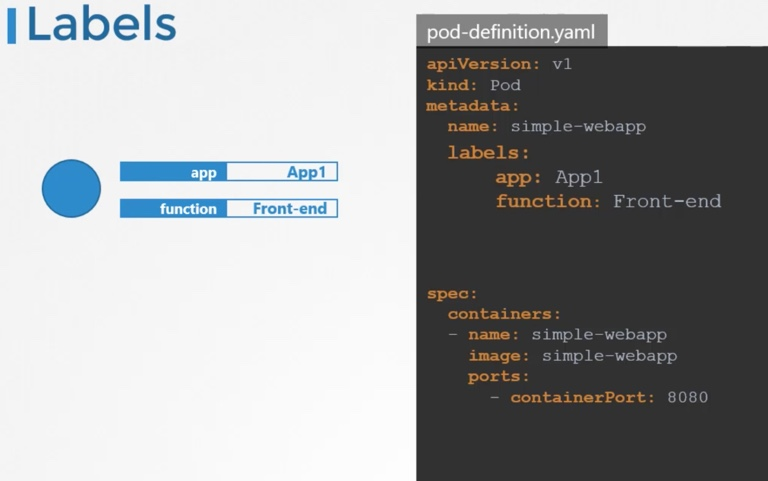


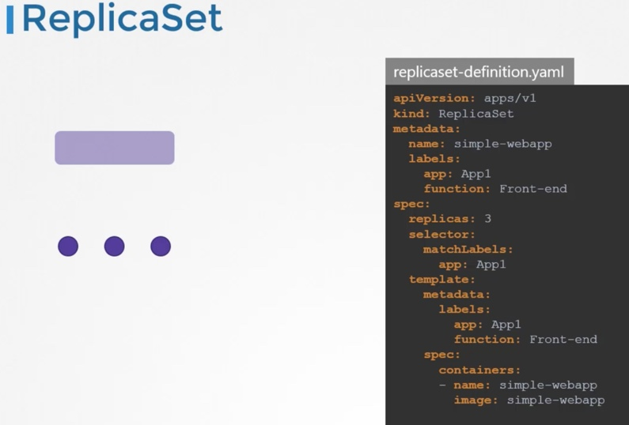

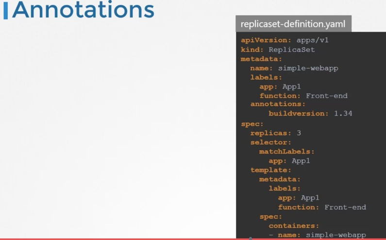

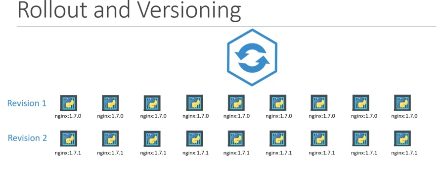


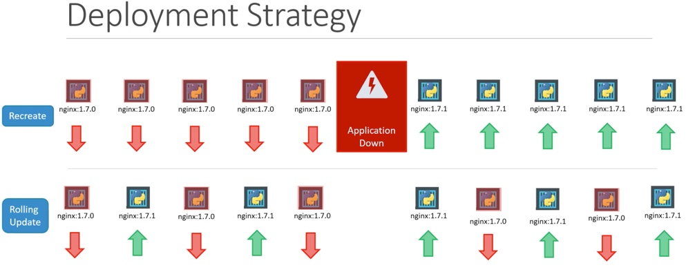


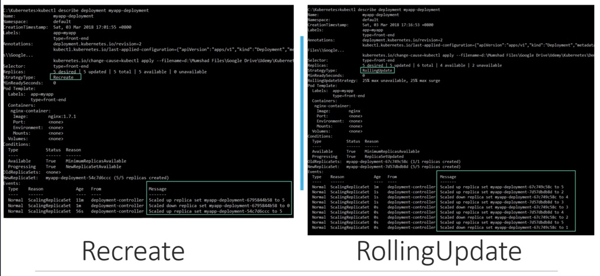

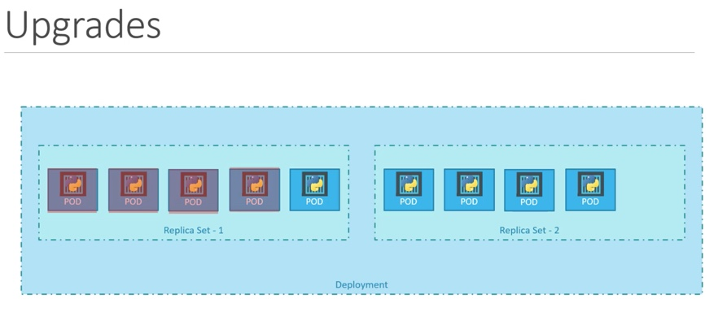

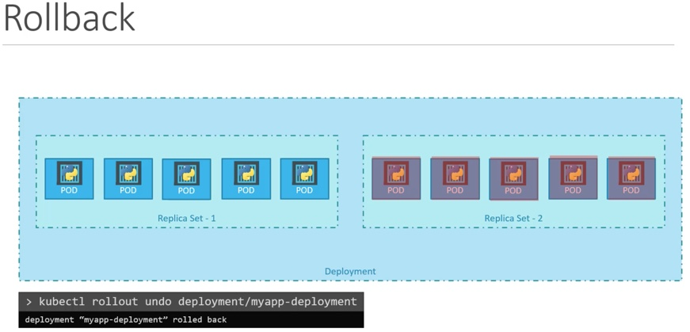

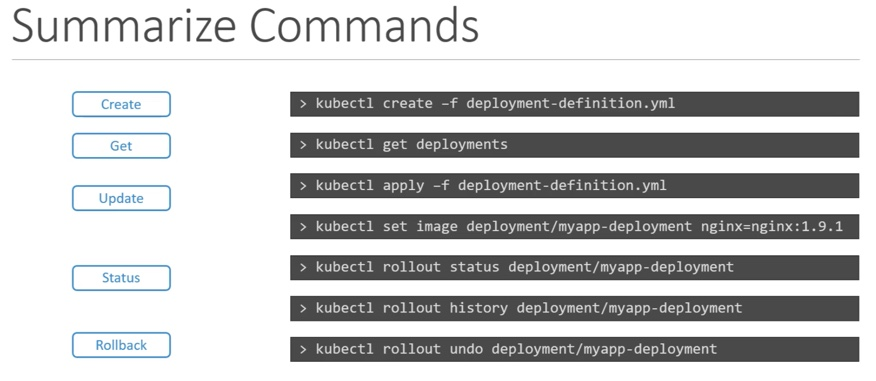


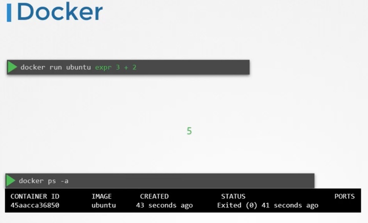

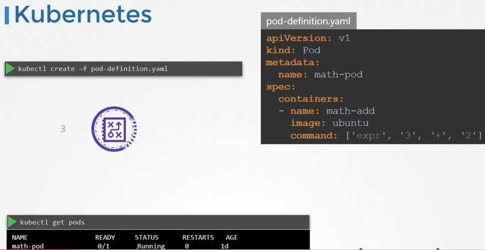

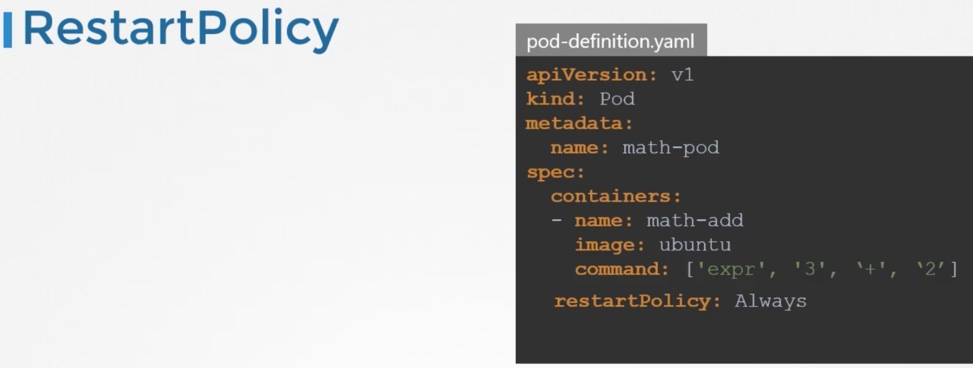

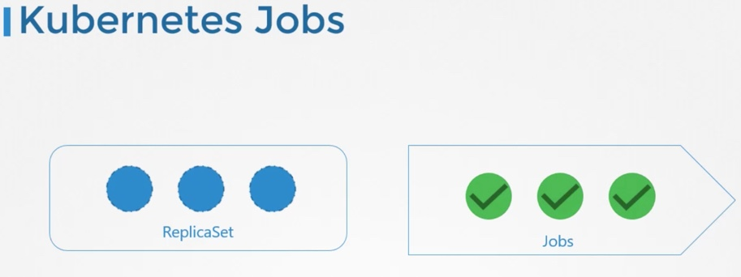

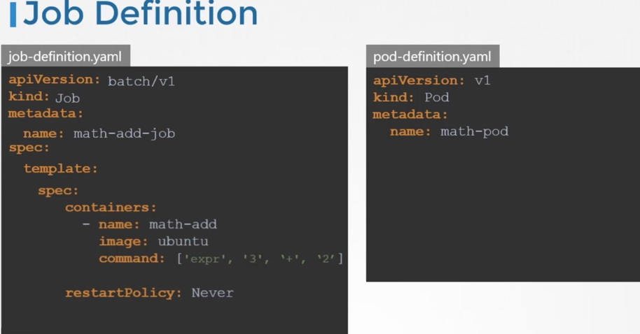

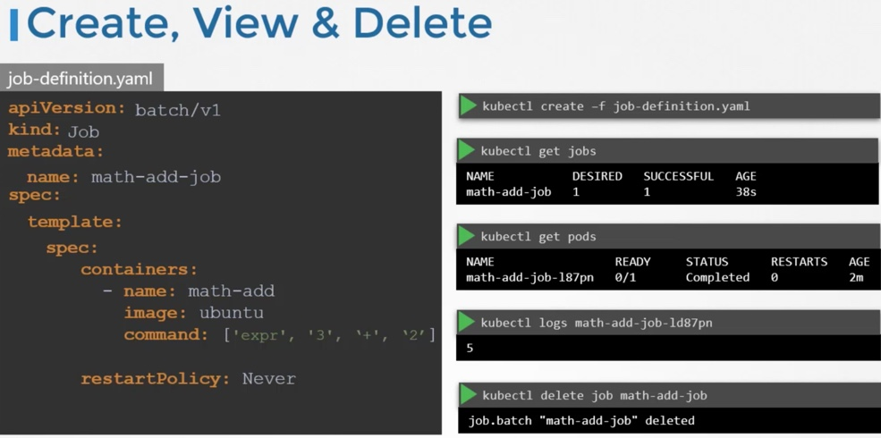

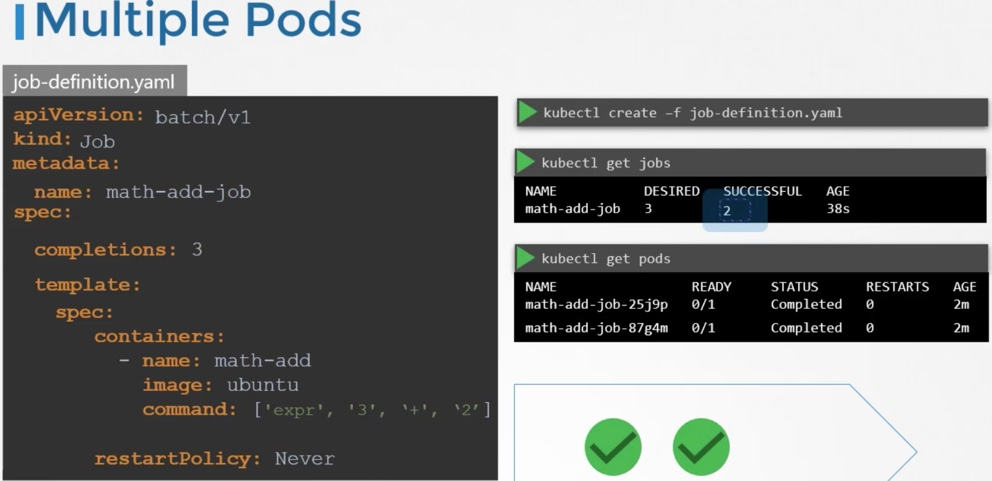

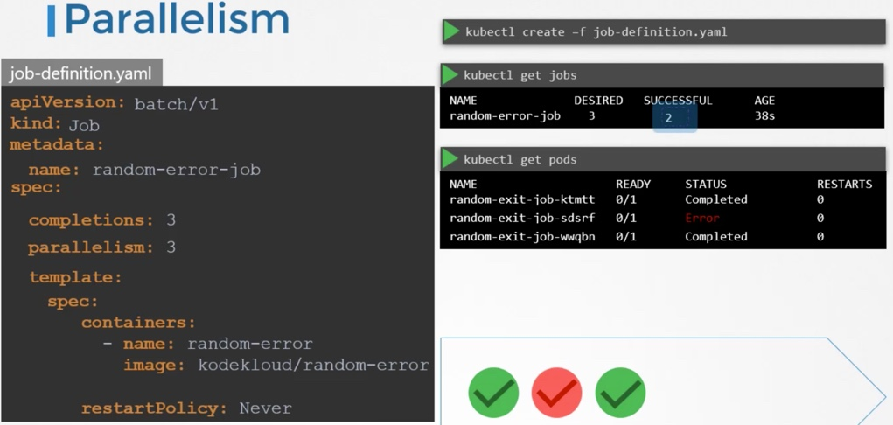


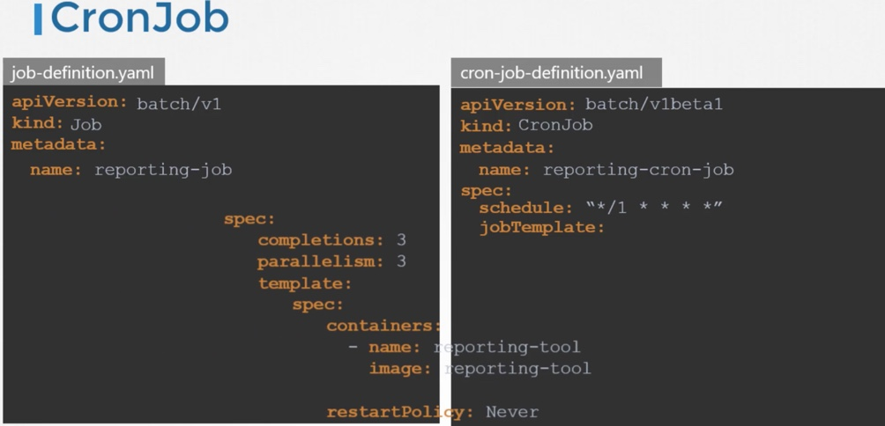

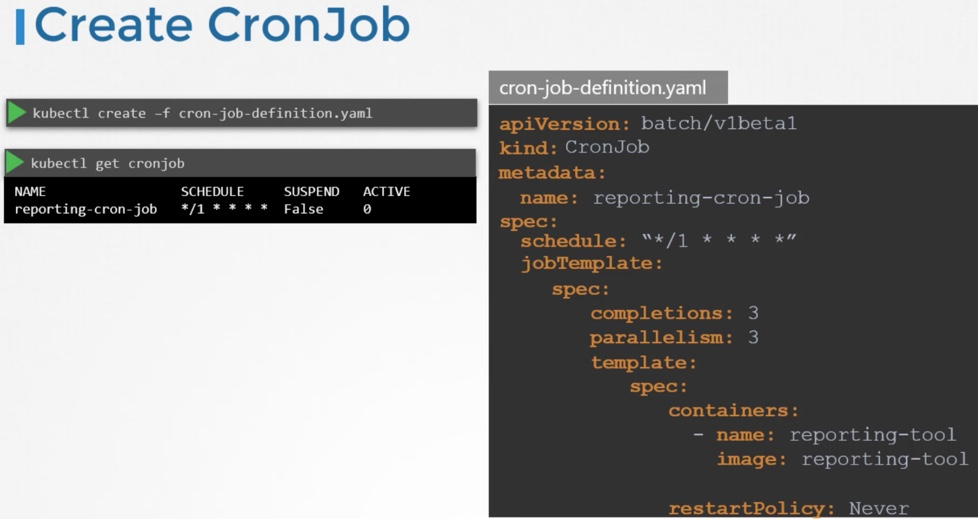

# Exercises

## Defining and Querying Labels and Annotations

1. Create three different Pods with the names `frontend`, `backend` and `database` that use the image `nginx`.
2. Declare labels for those Pods as follows:

- `frontend`: `env=prod`, `team=shiny`
- `backend`: `env=prod`, `team=legacy`, `app=v1.2.4`
- `database`: `env=prod`, `team=storage`

3. Declare annotations for those Pods as follows:

- `frontend`: `contact=John Doe`, `commit=2d3mg3`
- `backend`: `contact=Mary Harris`

4. Render the list of all Pods and their labels.
5. Use label selectors on the command line to query for all production Pods that belong to the teams `shiny` and `legacy`.
6. Remove the label `env` from the `backend` Pod and rerun the selection.
7. Render the surrounding 3 lines of YAML of all Pods that have annotations.

<details><summary>Show Solution</summary>
<p>

You can assign labels upon Pod creation with the `--labels` option.

```bash
$ kubectl run frontend --image=nginx --restart=Never --labels=env=prod,team=shiny
pod/frontend created
$ kubectl run backend --image=nginx --restart=Never --labels=env=prod,team=legacy,app=v1.2.4
pod/backend created
$ kubectl run database --image=nginx --restart=Never --labels=env=prod,team=storage
pod/database created
```

Edit the existing Pods with the `edit` command and add the annotations as follows:

```yaml
apiVersion: v1
kind: Pod
metadata:
  annotations:
    commit: 2d3mg3
    contact: John Doe
  name: frontend
...
```

```yaml
apiVersion: v1
kind: Pod
metadata:
  annotations:
    contact: 'Mary Harris'
  name: backend
...
```

Render all Pods and their Pods including their assigned labels.

```bash
$ kubectl get pods --show-labels
NAME       READY   STATUS    RESTARTS   AGE   LABELS
backend    1/1     Running   0          41s   app=v1.2.4,env=prod,team=legacy
database   1/1     Running   0          8s    env=prod,team=storage
frontend   1/1     Running   0          1m    env=prod,team=shiny
```

You can combine the selector rules into one expression.

```bash
$ kubectl get pods -l 'team in (shiny, legacy)',env=prod --show-labels
NAME       READY   STATUS    RESTARTS   AGE   LABELS
backend    1/1     Running   0          19m   app=v1.2.4,env=prod,team=legacy
frontend   1/1     Running   0          20m   env=prod,team=shiny
```

You can add and remove labels with the `label` command. The selection now doesn't match for the `backend` Pod anymore.

```bash
$ kubectl label pods backend env-
pod/backend labeled
$ kubectl get pods -l 'team in (shiny, legacy)',env==prod --show-labels
NAME       READY   STATUS    RESTARTS   AGE   LABELS
frontend   1/1     Running   0          23m   env=prod,team=shiny
```

The `grep` command can help with rendering any YAML code around the identified search term.

```bash
$ kubectl get pods -o yaml | grep -C 3 'annotations:'
- apiVersion: v1
  kind: Pod
  metadata:
    annotations:
      cni.projectcalico.org/podIP: 192.168.60.163/32
      contact: Mary Harris
    creationTimestamp: 2019-05-10T17:57:38Z
--
--
- apiVersion: v1
  kind: Pod
  metadata:
    annotations:
      cni.projectcalico.org/podIP: 192.168.60.147/32
    creationTimestamp: 2019-05-10T17:58:11Z
    labels:
--
--
- apiVersion: v1
  kind: Pod
  metadata:
    annotations:
      cni.projectcalico.org/podIP: 192.168.60.159/32
      commit: 2d3mg3
      contact: John Doe
```

</p>
</details>

## Performing Rolling Updates for a Deployment

1. Create a Deployment named `deploy` with 3 replicas. The Pods should use the `nginx` image and the name `nginx`. The Deployment uses the label `tier=backend`. The Pods should use the label `app=v1`.
2. List the Deployment and ensure that the correct number of replicas is running.
3. Update the image to `nginx:latest`.
4. Verify that the change has been rolled out to all replicas.
5. Scale the Deployment to 5 replicas.
6. Have a look at the Deployment rollout history.
7. Revert the Deployment to revision 1.
8. Ensure that the Pods use the image `nginx`.

<details><summary>Show Solution</summary>
<p>

Generate the YAML for a Deployment plus Pod for further editing.

```bash
$ kubectl create deployment deploy --image=nginx --dry-run -o yaml > deploy.yaml
```

Edit the labels. The selector should match the labels of the Pods. Change the replicas from 1 to 3.

```yaml
apiVersion: apps/v1
kind: Deployment
metadata:
  creationTimestamp: null
  labels:
    tier: backend
  name: deploy
spec:
  replicas: 1
  selector:
    matchLabels:
      app: v1
  strategy: {}
  template:
    metadata:
      creationTimestamp: null
      labels:
        app: v1
    spec:
      containers:
      - image: nginx
        name: nginx
        resources: {}
status: {}
```

Create the deployment by pointing it to the YAML file.

```bash
$ kubectl create -f deploy.yaml
deployment.apps/deploy created
$ kubectl get deployments
NAME     DESIRED   CURRENT   UP-TO-DATE   AVAILABLE   AGE
deploy   3         3         3            1           4s
```

Set the new image and check the revision history.

```bash
$ kubectl set image deployment/deploy nginx=nginx:latest
deployment.extensions/deploy image updated

$ kubectl rollout history deploy
deployment.extensions/deploy
REVISION  CHANGE-CAUSE
1         <none>
2         <none>

$ kubectl rollout history deploy --revision=2
deployment.extensions/deploy with revision #2
Pod Template:
  Labels:	app=v1
	pod-template-hash=1370799740
  Containers:
   nginx:
    Image:	nginx:latest
    Port:	<none>
    Host Port:	<none>
    Environment:	<none>
    Mounts:	<none>
  Volumes:	<none>
```

Now scale the Deployment to 5 replicas.

```bash
$ kubectl scale deployments deploy --replicas=5
deployment.extensions/deploy scaled
```

Roll back to revision 1. You will see the new revision. Inspecting the revision should show the image `nginx`.

```bash
$ kubectl rollout undo deployment/deploy --to-revision=1
deployment.extensions/deploy

$ kubectl rollout history deploy
deployment.extensions/deploy
REVISION  CHANGE-CAUSE
2         <none>
3         <none>

$ kubectl rollout history deploy --revision=3
deployment.extensions/deploy with revision #3
Pod Template:
  Labels:	app=v1
	pod-template-hash=454670702
  Containers:
   nginx:
    Image:	nginx
    Port:	<none>
    Host Port:	<none>
    Environment:	<none>
    Mounts:	<none>
  Volumes:	<none>
```

</p>
</details>

## Creating a Scheduled Container Operation

1. Create a CronJob named `current-date` that runs every minute and executes the shell command `echo "Current date: $(date)"`.
2. Watch the jobs as they are being scheduled.
3. Identify one of the Pods that ran the CronJob and render the logs.
4. Determine the number of successful executions the CronJob will keep in its history.
5. Delete the Job.

<details><summary>Show Solution</summary>
<p>

The `run` command is deprecated but it provides a good shortcut for creating a CronJob with a single command.

```bash
$ kubectl run current-date --schedule="* * * * *" --restart=OnFailure --image=nginx -- /bin/sh -c 'echo "Current date: $(date)"'
kubectl run --generator=cronjob/v1beta1 is DEPRECATED and will be removed in a future version. Use kubectl create instead.
cronjob.batch/hello created
```

Watch the Jobs as they are executed.

```bash
$ kubectl get cronjobs --watch
NAME                      COMPLETIONS   DURATION   AGE
current-date-1557522540   1/1           3s         103s
current-date-1557522600   1/1           4s         43s
```

Identify one of the Pods (the label indicates the Job name) and render its logs.

```bash
$ kubectl get pods --show-labels
NAME                            READY   STATUS      RESTARTS   AGE   LABELS
current-date-1557522540-dp8l9   0/1     Completed   0          1m    controller-uid=3aaabf96-7369-11e9-96c6-025000000001,job-name=current-date-1557523140,run=current-date

$ kubectl logs current-date-1557522540-dp8l9
Current date: Fri May 10 21:09:12 UTC 2019
```

The value of the attribute `successfulJobsHistoryLimit` defines how many executions are kept in the history.

```bash
$ kubectl get cronjobs current-date -o yaml | grep successfulJobsHistoryLimit:
  successfulJobsHistoryLimit: 3
```

Finally, delete the CronJob.

```bash
$ kubectl delete cronjob current-date
```

</p>
</details>
