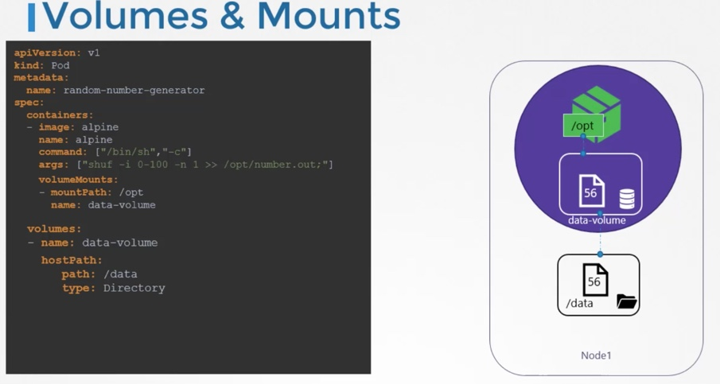
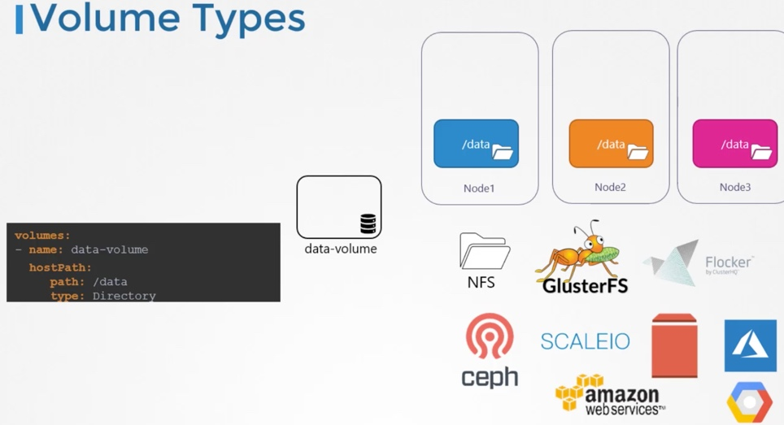
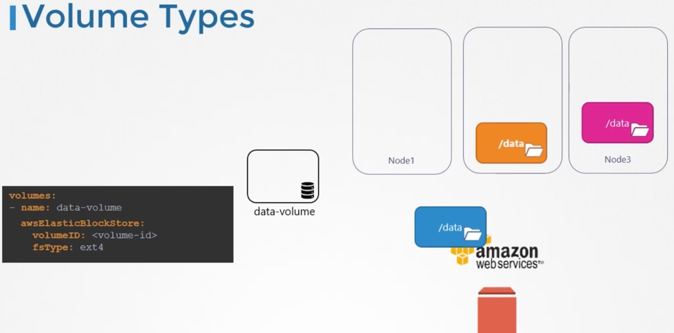
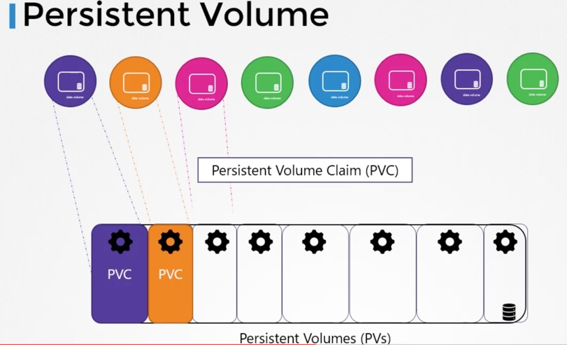
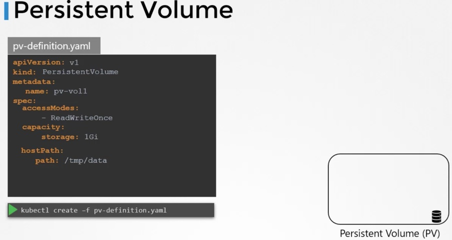
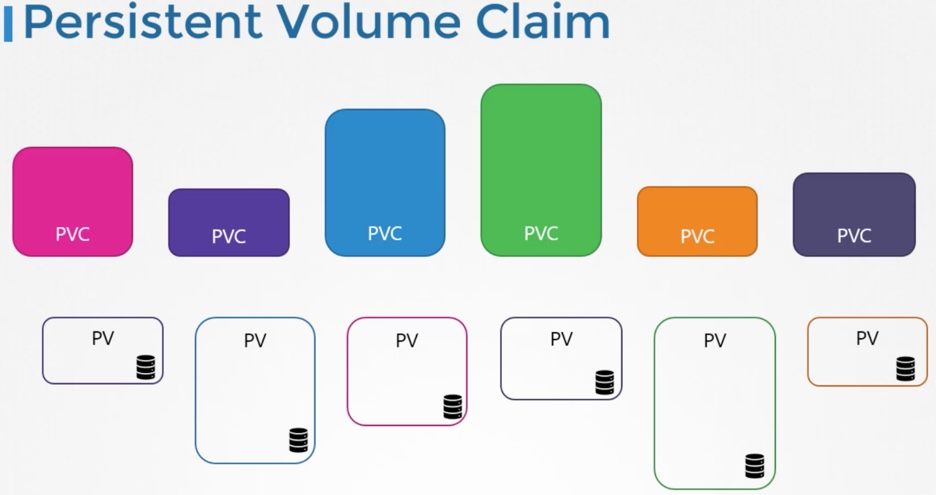
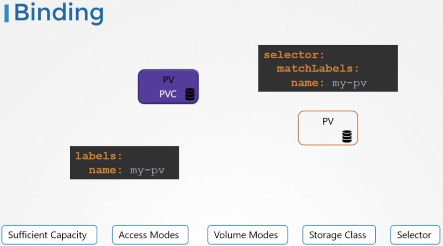
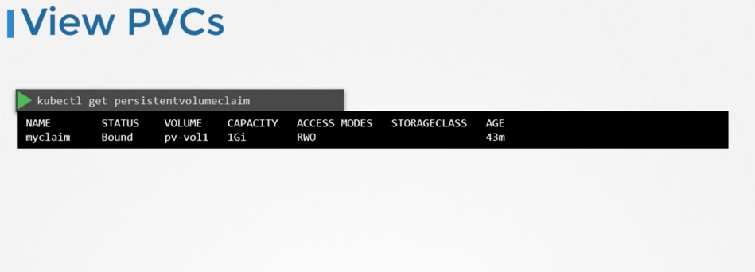

- By default, container storage is not persistent.
- To make the data generated in a container persistent, we use Volumes.
- How does this work in K8s world?
- As with Docker, K8s PODs are transient as well.
- To make them persistent, we attach a volume to the POD.
- Even after the POD is deleted, data is still retained.



- The above example uses **hostPath** as the type of Volume.
- This is not recommended in case of multiple node clusters.





## Persistent Volumes
- So far we have defined the volumes in the POD definition itself.
- This will make it difficult to maintain the volumes if they are defined in say 100 different PODs.
- We would like to manage the storage centrally and then have users carve-out pieces as required.
- This is where PVs help us.
- The users can claim these volumes using Persistent Volume Claims.





## Persistent Volume Claims

- PVCs are used to make the storage available to the PODs by claiming a Persistent Volume.









Reference: https://kubernetes.io/docs/concepts/storage/persistent-volumes/#claims-as-volumes

# Exercises
# State Persistence (8%)

## Defining and Mounting a PersistentVolume

1. Create a Persistent Volume named `pv`, access mode `ReadWriteMany`, storage class name `shared`, 512MB of storage capacity and the host path `/data/config`.
2. Create a Persistent Volume Claim named `pvc` that requests the Persistent Volume in step 1. The claim should request 256MB. Ensure that the Persistent Volume Claim is properly bound after its creation.
3. Mount the Persistent Volume Claim from a new Pod named `app` with the path `/var/app/config`. The Pod uses the image `nginx`.
4. Check the events of the Pod after starting it to ensure that the Persistent Volume was mounted properly.

<details><summary>Show Solution</summary>
<p>

Create a YAML file for the Persistent Volume and create it with the command `kubectl create` command.

```yaml
apiVersion: v1
kind: PersistentVolume
metadata:
  name: pv
spec:
  capacity:
    storage: 512m
  accessModes:
    - ReadWriteMany
  storageClassName: shared
  hostPath:
    path: /data/config
```

You will see that the Persistent Volume has been created but and is available to be claimed.

```bash
$ kubectl get pv
NAME   CAPACITY   ACCESS MODES   RECLAIM POLICY   STATUS      CLAIM   STORAGECLASS   REASON   AGE
pv     512m       RWX            Retain           Available           shared                  4s
```

Create a YAML file for the Persistent Volume Claim and create it with the command `kubectl create` command.

```yaml
kind: PersistentVolumeClaim
apiVersion: v1
metadata:
  name: pvc
spec:
  accessModes:
    - ReadWriteMany
  resources:
    requests:
      storage: 256m
  storageClassName: shared
```

You will see that the Persisten Volume Claim has been created and has been bound to the Persisten Volume.

```bash
$ kubectl get pvc
NAME   STATUS   VOLUME   CAPACITY   ACCESS MODES   STORAGECLASS   AGE
pvc    Bound    pv       512m       RWX            shared         2s

$ kubectl get pv
NAME   CAPACITY   ACCESS MODES   RECLAIM POLICY   STATUS   CLAIM         STORAGECLASS   REASON   AGE
pv     512m       RWX            Retain           Bound    default/pvc   shared                  1m
```

Create a YAML file for the Pod and create it with the command `kubectl create` command.

```yaml
apiVersion: v1
kind: Pod
metadata:
  creationTimestamp: null
  labels:
    run: app
  name: app
spec:
  containers:
  - image: nginx
    name: app
    volumeMounts:
      - mountPath: "/var/app/config"
        name: configpvc
    resources: {}
  volumes:
    - name: configpvc
      persistentVolumeClaim:
        claimName: pvc
  dnsPolicy: ClusterFirst
  restartPolicy: Never
status: {}
```

You can check the events of a Pod with the `kubectl describe` command. You should see an entry that indicates the successful mount.

```bash
$ kubectl describe pod app
...
Events:
  Type    Reason                 Age   From                         Message
  ----    ------                 ----  ----                         -------
  Normal  Scheduled              16s   default-scheduler            Successfully assigned app to docker-for-desktop
  Normal  SuccessfulMountVolume  16s   kubelet, docker-for-desktop  MountVolume.SetUp succeeded for volume "pv"
  Normal  SuccessfulMountVolume  16s   kubelet, docker-for-desktop  MountVolume.SetUp succeeded for volume "default-token-fsmmp"
  Normal  Pulling                15s   kubelet, docker-for-desktop  pulling image "nginx"
  Normal  Pulled                 14s   kubelet, docker-for-desktop  Successfully pulled image "nginx"
  Normal  Created                14s   kubelet, docker-for-desktop  Created container
  Normal  Started                13s   kubelet, docker-for-desktop  Started container
```

</p>
</details>

