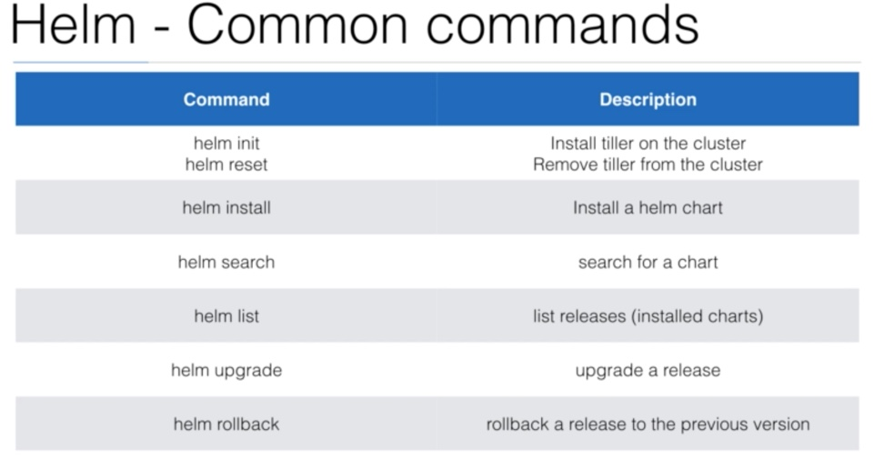
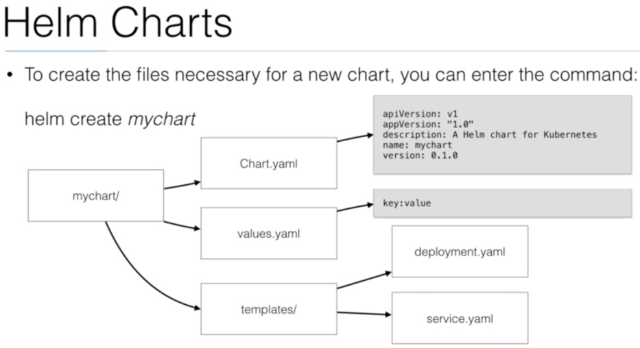

## Introduction
- Helm is the best way to find, share and use software build for Kubernetes 
- Helm is a Package manager for K8s
- It helps you to manage Kubernetes applications
- Helm is maintained by the CNCF

## Using
- To start using Helm, you need to download the Helm client
- You need to run `helm init` to initialize Helm on Kubernetes Cluster
  - This will install Tiller
  - If you have RBAC installed, you'll also need to add a Service Account and RBAC rules
- After this Helm is ready for use, and you can start installing Charts.

## Charts
- Helm uses a packaging format called Charts
  - A chart is a set of files that describe a set of Kubernetes resources
- A single chart can deploy a piece of software, an app or a database
- You can also write your own charts to deploy your application on K8s
- Charts use templates that are typically developed by a package maintainer.
- They will generate YAML files that K8s will understand
- You can think of templates as dynamic YAML files that contain conditional statements

