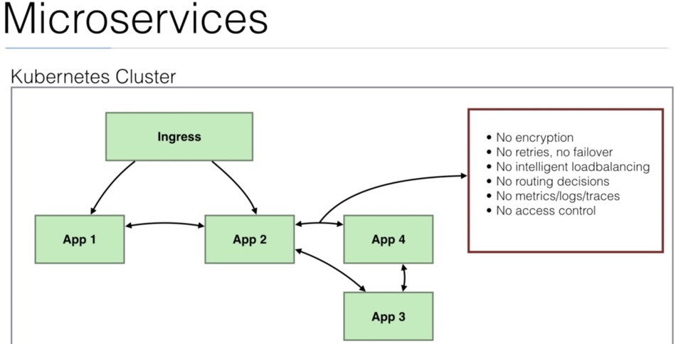
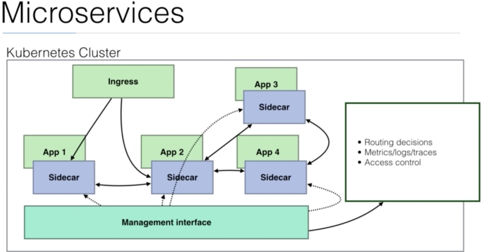
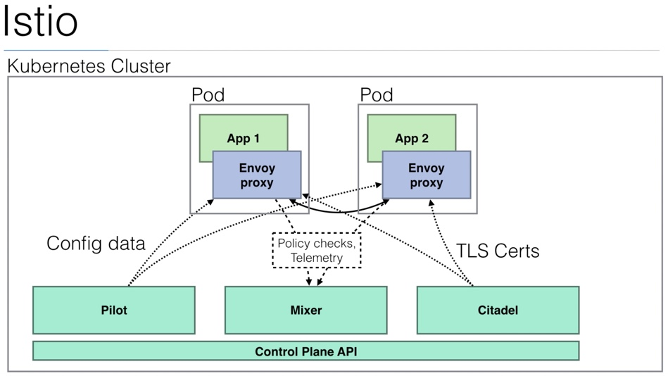
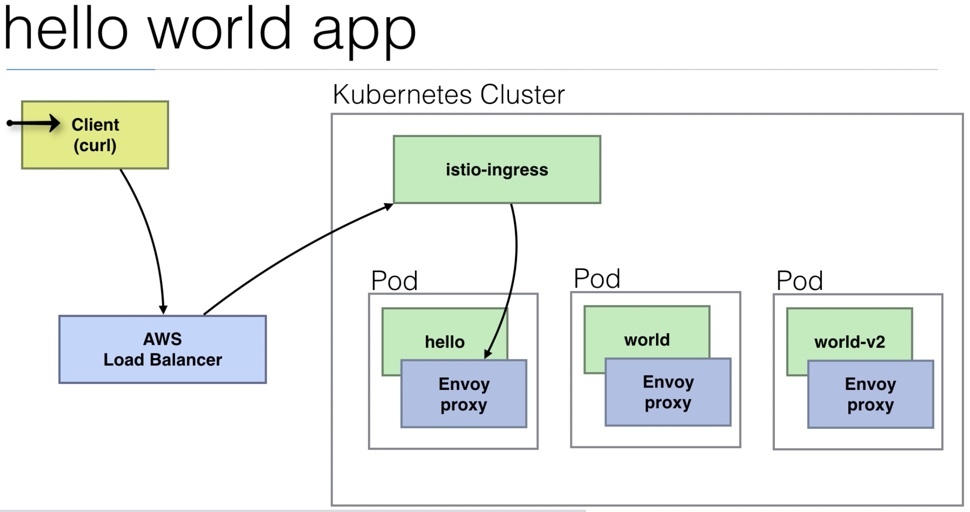
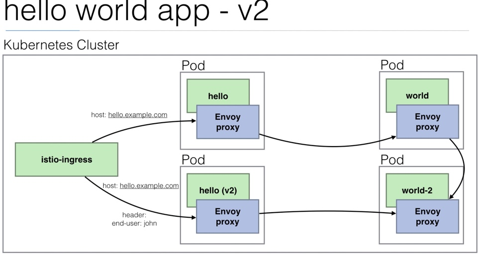
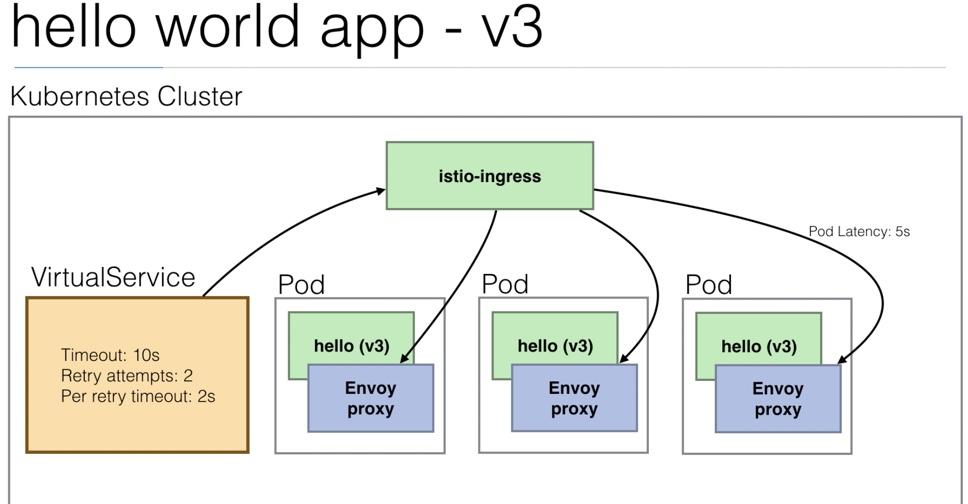

- One solution is to add a side car that solves the above problems





## Installing Istio

- To install Istio, modify the Kops cluster to use a node size of t2-medium as Istio needs more memory to run the processes.
- Edit the Kops cluster to add the following under `spec`:

```
kubeAPIServer:
    admissionControl:
    - NamespaceLifecycle
    - LimitRanger
    - ServiceAccount
    - PersistentVolumeLabel
    - DefaultStorageClass
    - DefaultTolerationSeconds
    - MutatingAdmissionWebhook
    - ValidatingAdmissionWebhook
    - ResourceQuota
    - NodeRestriction
    - Priority
```

- Download and install Istio:
## download (1.0.3):
```
cd ~
wget https://github.com/istio/istio/releases/download/1.0.3/istio-1.0.3-linux.tar.gz
tar -xzvf istio-1.0.3-linux.tar.gz
cd istio-1.0.3
echo 'export PATH="$PATH:/home/ubuntu/istio-1.0.3/bin"' >> ~/.profile
```

## Download (latest):
```
cd ~
curl -L https://git.io/getLatestIstio | sh -
echo 'export PATH="$PATH:/home/ubuntu/istio-1.0.3/bin"' >> ~/.profile # change 1.0.3 in your version
cd istio-1.0.3 # change 1.0.3 in your version
```

## Istio install

Apply CRDs:

```
kubectl apply -f ~/istio-1.0.3/install/kubernetes/helm/istio/templates/crds.yaml
```

Wait a few seconds.


Option 1: with no mutual TLS authentication
```
kubectl apply -f ~/istio-1.0.3/install/kubernetes/istio-demo.yaml
```

Option 2: or with mutual TLS authentication
```
kubectl apply -f ~/istio-1.0.3/install/kubernetes/istio-demo-auth.yaml
```

## Istio enabled app



- Use `helloworld.yaml` from the Istio folder to deploy the app.
- We will use IstioCTL instead of Kubectl to deploy this app.
```
export PATH="$PATH:/home/ubuntu/istio-1.0.3/bin"
kubectl apply -f <(istioctl kube-inject -f helloworld.yaml)

```

- Install the Istion Gateway for the app:
```
kubectl apply -f helloworld-gw.yaml
```

- Get the URL for the service using `kubectl get svc -n istio-system -o wide`
- Curl to the above URL : `curl URL`. This will not return anything. Append `/hello` to the URL.

## Advanced Routing with Istio


- Checkout `helloworld-v2.yaml` from the Istio directory.
- Notice that the service defined in the YAML has a selector as `app:hello`.
- This will route traffic to both the PODs, V1 and V2. This is not something we want.
- This is handled in the `helloworld-v2-routing.yaml` where we will define Istio specific rules to route the traffic.

```
kubectl apply -f <(istioctl kube-inject -f helloworld-v2.yaml)
kubectl apply -f helloworld-v2--routing.yaml
```

- Get the service URL using the same steps as above.
- But this time `/hello` endpoint will return a 404 since we have only 1 virtual service defined.
- Execute `curl URL -H "host: hello.example.com` and this should return `Hello world !!!`
- Execute `curl URL -H "host: hello.example.com -H "end-user:john"` and this should return `Hello this is V2`.


## Canary Deployments


- Checkout `helloworld-v2-canary.yaml` in the Istio folder.

```
kubectl apply -f helloworld-v2-canary.yaml
```

- Get the service URL as above and run `curl URL -H "host: hello.example.com` several times to notice the Canary.
- 

## Retries



- Checkout the `helloworld-v3.yaml` from the Istio directory.
- Get the service URL as above.
- Execute: `curl URL -H "host: hello-v3.example.com`
- To observe the retries in Istio, let's run a `for` loop with a `time` option:

```
for ((i=1;i<=10;i++)) do time curl URL -H "host: hello-v3.example.com"; done
```


